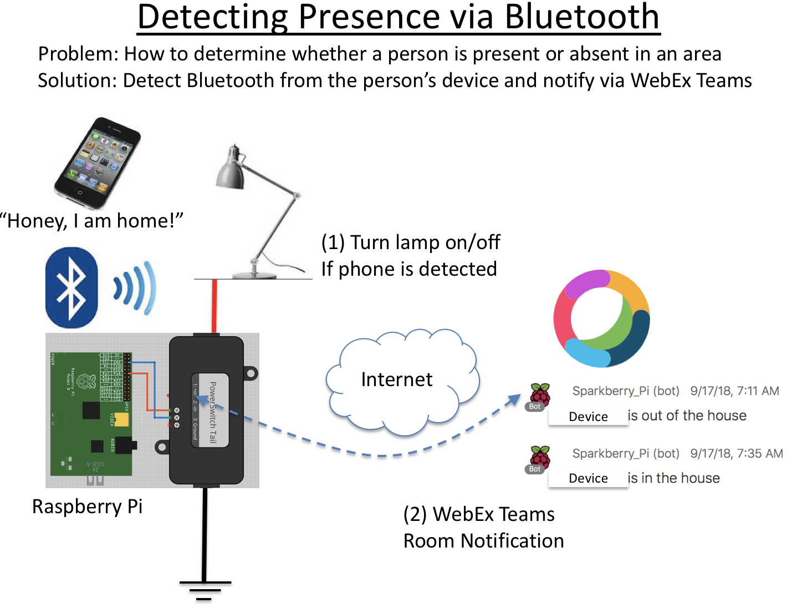
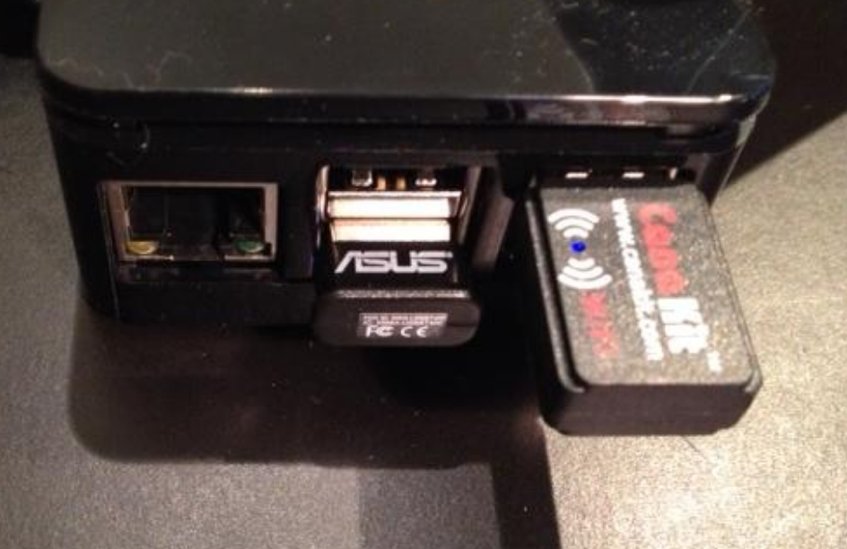
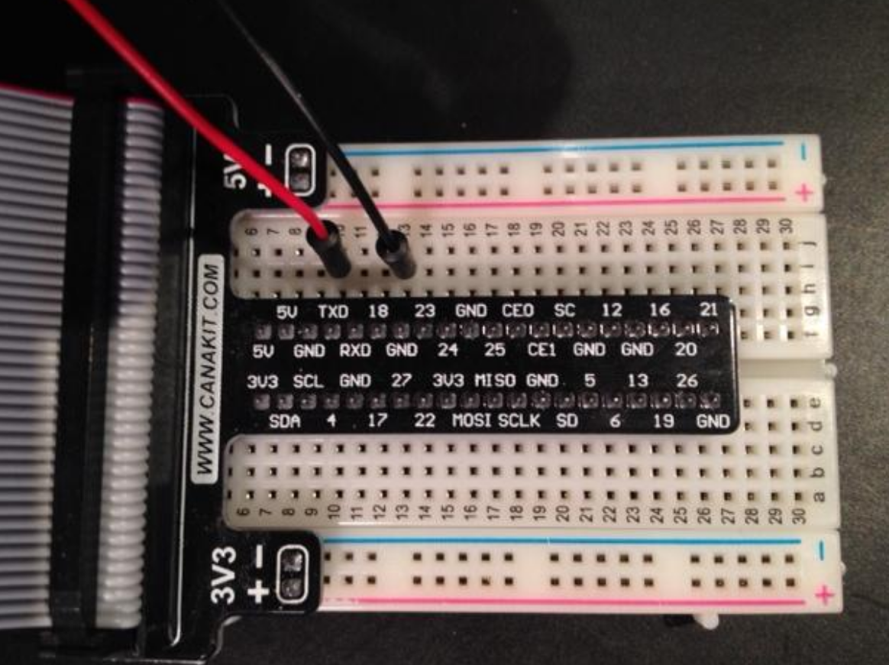

# Detecting Bluetooth Presence on Raspberry Pi and Sending Notification to WebEx Teams
For this project I have modified the Pi to detect the presence of my iPhone using Bluetooth signal.  The objective is to detect whether a particular device within the vicinity of the Pi and then take some actions.   (An example situation is checking whether someone in your family is home or not, sort of a "poor man surveillance')

 

Once a Bluetooth device is detected, I programmed my Pi to:  (1) Turn on a lamp, (2) send an message to a WebEx Teams room.

## Components and Setup:

I configured the Raspberry Pi to run Raspbian.  There is a lot of resources on the web on how to setup the Pi.  I recommend the Raspberry Pi Cookbook which tells you the exact steps to get the Pi running.  The kit I used also contains an USB WiFi dongle, a breakout ribbon cable to connect to the I/O pins and a breadboard.

 
I also added a Bluetooth USB dongle.  I used one made by Asus but any Bluetooth dongle should do.  You do need to install drivers to activate Bluetooth.  Here is the link to the instruction:

http://www.raspberrypi.org/learning/robo-butler/bluetooth-setup/

Here is how the WiFi and Bluetooth dongles are connected to the Pi.

The breakout ribbon and the breadboard are for connecting external peripherals.  For my project I want the PI to turn on/off a lamp.  In order to turn on a AC device, I needed a power brick with a switch relay.  I got one from "PowerSwitch".  Note that there are two lead wires coming out of the power brick.  Inside the brick is an "opto-isolator" that turns the power on and off depending whether a signal is received on the lead wires.  The lead wires are connected to the Raspberry Pi via the breadboard.

The difficult part is to figure out which pins to connect the lead wire.  After some tries, I discovered that I am connected to pin "8".

## Putting It All Together

 

Once I got all the hardware connected.  It's time to do some Python!

 

The four things I want the PI to do are:

(1) Detect Bluetooth signal

(2) Activate the I/O pins on the Pi to turn on the relay switch to turn on/off the lamp.

(3) Send notification to WebEx Teams using a Bot

 

Luckily, other folks on the web already have created library modules for all the functions.  All I have to do is import the libraries into my program.

 

Here are the library modules I imported into the program.

 
_import requests_

_import bluetooth_

_import time_

_import RPi.GPIO as GPIO_

 

They are pretty much self-explanatory.  The "GPIO" is the module that controls the I/O pins of the Pi.

 
I used codes from the following resources as templates:

Raspberry Pi Cookbook for GPIO codes,    This URL contains code for Bluetooth detection: http://http://www.instructables.com/id/Raspberry-Pi-Bluetooth-InOut-Board-or-Whos-Hom/

 

The heart of the program is inside the "while" loop, every 5 seconds the Pi will look for a particular Bluetooth address.  If the address is detected, then pin 8 would be triggered (thus turning on the lamp) and notifications are sent to WebEx Teams.  The same actions happen when the Pi can no longer detect the Bluetooth address.
